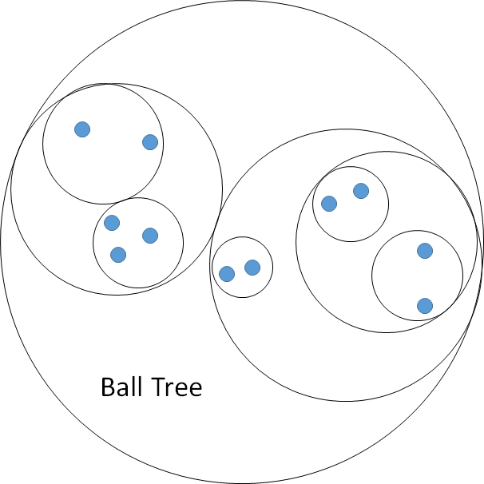

游戏项目中经常有大量的重复或相似图片，是影响安装包体积的重要因素
查找哪些图片相似，经常要预设某张图片可能重复，然后进行比对，很容易遗漏重复资源
为了减少图片冗余和方便分包拆分资源，需要一种能够快速找出相似图片的方法，提供下面 2 个功能：

1. 输入一张图片，找出项目中与之相似的图片
2. 直接列出项目中所有相似图列表

## 游戏项目的痛点

### 1. 数据规模大

以某个图片库为例，**大约 57000 张图片**需要进行相似性分析，直接的两两比对方法在实际生产中不可行

-   **内存压力**：同时处理所有图片，峰值内存较高
-   **计算瓶颈**：直接列出所有相似图，如何优化计算复杂度

### 2. 图片类型多

游戏图片与自然照片的本质区别：

-   **透明度信息关键**：UI 元素、特效贴图通常包含大量透明区域，Alpha 通道携带的形状信息与 RGB 同等重要，需要自适应权重
-   **内容差异显著**：游戏资产包含 UI 图标、特效粒子、遮罩纹理等，类型不一致的图片会放在一起对比，需要兼容，且不像照片那样有连续的自然场景，不适合使用提取图片语义的预训练模型

## 已有方案

图片匹配已有多种成熟方法，但针对游戏项目的特定需求，需要仔细权衡各方案的优劣：

### 1. 模板匹配

**原理**：直接对比像素值，使用平方差、相关系数等度量方法
**优势**：结果精确，实现简单
**劣势**：

-   计算复杂度 O(N²·P)，其中 P 是像素数
-   对尺寸、旋转、光照变化极度敏感

**结论**：仅适合结果验证阶段，不适合大规模初筛

### 2. SSIM (结构相似性)

**原理**：从亮度、对比度、结构三个维度衡量图片相似度
**优势**：符合人眼感知，对压缩失真不敏感
**劣势**：

-   计算量比模板匹配更大(需要多尺度窗口滑动)
-   对透明通道处理不友好
-   同样面临 O(N²·P)复杂度问题

**结论**：性能较差，无法解决大规模处理问题

### 3. 图片哈希 (aHash/dHash/pHash/wHash)

**原理**：降采样至 8×8 后，生成 64 位哈希值

> 四个不同的方法计算的分别是：
> aHash (Average Hash / 平均哈希)：图像灰度值与平均灰度的大小关系
> dHash (Difference Hash / 差异哈希)：相邻像素间的灰度差异梯度
> pHash (Perceptual Hash / 感知哈希)：图像的 DCT（离散余弦变换）低频系数
> wHash (Wavelet Hash / 小波哈希)：图像的 DWT（小波变换）低频子带系数

**优势**：

-   极快的比对速度(位运算)
-   可以忽略轻微变化

**劣势**：

-   信息损失严重：8×8 无法表达图片的细节
-   初筛后哈希数据作废，无法用于精确排序
-   原版算法只支持亮度通道

**结论**：分层处理的方法值得借鉴，但需要更强的特征表达

### 4. SIFT/ORB 特征点匹配

**原理**：检测图像中的角点、边缘等关键点，提取局部描述子进行匹配
**优势**：支持旋转、缩放、部分遮挡的图片匹配
**劣势**：无法处理平滑图片

-   很多游戏 UI 元素(纯色背景、渐变按钮)提取不到足够特征点，甚至有的图有 0 个特征点，比如下面的两张图

<div align="center">
  
</div>
<div align="center">
  
</div>

**结论**：对于自然场景有效，但对游戏图片(尤其 UI 类)效果不好

### 5. 深度学习特征 (VGG/ResNet)

**原理**：使用预训练 CNN 提取高层语义特征
**优势**：能识别"语义相似"(如不同角度的同一物体)
**劣势**：

-   需要 GPU：有兼容性问题
-   深度特征偏向高层语义，对游戏图片的像素级差异不够敏感，即使使用低层作为特征，如 VGG16 的 Block3 并去除池化层，结果也有很强的语义相似性，而非像素相似

**结论**：对于像素级相似检测，深度学习方法并不合适

---

## 解决方案

通过上述分析，理想方法需要满足：

1. **特征表达能力**
    > 比 8×8 哈希更多的信息，能保留足够细节
2. **计算效率高**
3. **支持透明通道**
4. **可索引性**
    > 特征可用于后续聚类和快速检索，不像哈希那样"用完即扔"

五阶段分层计算，每个阶段的过程如下：

```
阶段1：特征提取 (Lab+Alpha → DCT 32×32×4)
  原始图像归一化(256×256×4) → DCT变换 → 4096维特征向量

阶段2：特征降维 (随机森林选择)
  4096维 → 伪标签聚类 → RF特征重要性 → 降维到500

阶段3：聚类索引 (MiniBatchKMeans)
  57000张图 → 4000个簇 → 每簇平均14张 → 复杂度O(N²/k)

阶段4：空间索引 (BallTree)
  为每个簇构建BallTree → 查询复杂度O(log n)

阶段5：相似性搜索
  单图查询：簇内精确搜索 + 可以跨簇扩展
  全量扫描：簇内图连通分量算法 → 输出相似组
```

---

### 阶段 1：提取图片的 DCT 频域特征

#### 把图片从空间域转换到频域

JPEG 使用 DCT(离散余弦变换)将图像从空间域转换到频域，借鉴 JPEG 压缩的方法：

**DCT(离散余弦变换)的过程**：

-   将 256×256 像素图像分解为不同频率的余弦波组合，可以简单理解为二维的 FFT，输出 256×256 维的浮点数
-   越靠近左上角的系数表示越低频的成分，越靠近右下角表示越高频的成分，选择左上角 N×N 个低频系数可以保留图片主体信息
-   DCT 系数是连续的浮点数，可直接用于多个下游任务

DCT 数据通过逆变换可以重建出近似原图，下面展示不同 DCT 尺寸对图像重建质量的影响（每行从左到右：原始图、DCT 系数可视化、重建图）：

**256×256 DCT（完整保留，信息保留率 100%）：**

<div align="center">
  
</div>

**64×64 DCT（信息保留率 6.25%）：**

<div align="center">
  
</div>

**32×32 DCT（信息保留率 1.56%）：**

<div align="center">
  
</div>

**8×8 DCT（信息保留率 0.10%）：**

<div align="center">
  
</div>

从上面的对比可以看到，32×32 DCT 能保留图标的主要特征和细节
本项目使用 32×32，对于高精度需求也可以选择 64×64

#### Lab+Alpha 四通道

**使用 Lab 色彩空间+Alpha 通道**

-   **Lab 色彩空间**：L(亮度)与 ab(色彩)分离，更符合人眼感知
-   **Alpha 通道独立**：游戏 UI 元素的透明通道非常重要，单独处理
-   **处理流程**：RGB+Alpha → Lab+Alpha → 各自计算 DCT → 拼接为 4096 维向量

#### 工程优化：缓存 DCT 信息

处理大量图片，每次重启都提取特征耗时较高

**解决方案**：每个图片单独缓存计算结果，通过校验确保缓存有效：

1. 检查 DCT 参数配置是否变化（尺寸、色彩空间）
2. 检查文件修改时间和内容哈希，处理修改图片的情况

-   对于文件夹中的图片文件，先对比时间，然后使用 CRC32 等轻量级 hash 算法
-   对于 UE 引擎，uasset 文件默认保存了 hash 信息（图集中的图片共享一个 hash），可以直接使用

日常使用中，只有新增或修改的图片需要重新提取，变化图片占比<10%，后续的模型都只需要增量更新，不需要读取全部特征数据

---

### 阶段 2：特征降维

上一步得到的特征 4096 维过高，直接用于聚类和索引会导致计算效率低

-   高维空间中点与点距离趋于相等，聚类算法失效
-   计算复杂度随维度线性增长
-   特征数量接近样本数，会出现过拟合问题，影响泛化性能

使用数据驱动的**随机森林特征选择**方法，降维至 500 维，平衡信息数量和计算效率

> 主要是实际测试结果，随机森林方法的准确率明显优于 PCA、方差选择、单变量统计

#### 随机森林 vs PCA

| 对比维度     | 随机森林(特征选择)                      | PCA(特征变换)        |
| ------------ | --------------------------------------- | -------------------- |
| **原理**     | 选择原始 DCT 系数的子集                 | 线性组合生成新正交基 |
| **监督信号** | 有监督(伪标签)，知道哪些特征能区分簇    | 无监督，仅最大化方差 |
| **非线性**   | 决策树可学习特征间的关系(如 Alpha+亮度) | 仅线性权重组合       |
| **去噪能力** | 直接丢弃不重要特征                      | 噪声特征也参与组合   |

#### 降维目标选择

实际测试 500 维效果比较好

#### 保存特征选择模型

随机森林模型训练完成后，保存到文件，后续新增图片只需加载模型，无需重新训练

---

### 阶段 3：图片聚类

-   **KMeans 聚类**：将图片分簇，平均每个簇内 15 张图，复杂度从 O(N²)降至 O(N²/k)，k 约为簇数量
-   **支持增量更新**：新增小于一定比例时，无需全量重算

#### KMeans 聚类

根据图片数量选择不同的 KMeans 变体：

| 对比维度 | MiniBatchKMeans      | 标准 KMeans  |
| -------- | -------------------- | ------------ |
| 适用规模 | >10000 样本          | <10000 样本  |
| 收敛速度 | **3-5 倍更快**       | 慢           |
| 内存占用 | 批处理(1000 张/批)   | 全量加载     |
| 聚类质量 | 略低                 | 最优         |
| 增量支持 | partial_fit 支持微调 | 需完全重训练 |

#### 簇数量选择

**KMeans 聚类中选择簇数量的经验法则**：`n_clusters ≈ sqrt(N) 到 N/15`，对于 57000 张图 → 239 至 3800

**为什么选择 4000 簇？**

1. 相似图会聚集在同一簇，实际分布通常并不均匀，簇内图数量不宜过多，避免影响查询效率，所以选择偏高的簇数量
2. 聚类时间可接受，且模型有缓存机制

> 需要注意的是，MiniBatchKMeans 簇数量不能动态修改，如果图片数量变化较大，需要重新选择簇数量并训练新模型，否则结果会变差

#### 增量更新：应对项目持续迭代

游戏项目每天新增/修改 50-500 张图，通常只需要计算新增/修改的原始特征值，然后用缓存的特征选择模型计算降维后特征，再使用 MiniBatchKMeans 的 `partial_fit` 方法微调模型，支持增量学习，新增 <10% 图片无需重新计算

---

### 阶段 4：构建 BallTree 空间索引

为了同时满足一次性列出所有相似图片和单图实时查询的需求，需要为每个簇独立构建高效的空间索引结构
**BallTree** 天然适合高维数据的近邻搜索，且查询复杂度为 O(log n)，非常适合本项目的场景，且构建速度快，可以不缓存，每次启动时动态构建

<div align="center">
  
</div>

至此，索引结构如下：

```
Level 1：簇级索引 (4000个簇中心)
    ↓ 预测查询图片所属簇 - O(4000)
Level 2：簇内索引 (BallTree， 平均14张图)
    ↓ 精确搜索 - O(log 14) ≈ O(4)
Result：Top-K相似图片
```

---

### 阶段 5a：单图查询

**输入**：查询的图片

**处理流程**：

1. **特征提取与降维**：对查询图片提取 DCT 特征(4096 维) → 随机森林降维(500 维)
2. **预测所属簇**：使用 KMeans 模型预测图片最可能属于的簇 ID
3. **簇内搜索**：在预测簇内使用 BallTree 进行 k 近邻搜索，返回 Top-K 相似图片
4. **可选跨簇扩展**：可搜索相邻的 1-3 个簇，合并结果并按距离排序

**输出**：相似图片列表（路径 + 相似度分数），按相似度降序排列

**性能**：单次查询毫秒级，满足实时要求

---

### 阶段 5b：全量扫描

利用聚类结果进行分治处理，避免全局两两比对
使用图连通分量算法，自动发现所有相似图片组

**输入**：全部图片的特征向量（非第一次运行时直接使用缓存的模型）、相似度阈值

**处理流程**：

1. **簇内独立处理**：对每个簇分别处理，簇间可并行
2. **BallTree 半径查询**：对每张图片使用 `query_radius(distance_threshold)` 找出距离小于阈值的所有邻近图片
3. **构建相似图**：基于半径查询结果构建无向图
4. **连通分量提取**：使用 DFS 算法找出图中的所有连通分量，每个连通分量即为一个相似组
5. **计算相似度得分**：对于每个相似组，计算组内中心点，各图片到中心的距离作为相似度得分，便于排序和展示

**输出**：相似图片组列表，每组包含多张相似图片的路径和相似度

**为什么选择图连通分量算法？**

-   **基于真实相似关系构图**：构建无向图时，仅当两张图片距离小于阈值时才建立边
-   **自然处理相似性传递问题**：如果 A 与 B 相似、B 与 C 相似形成连通分量，说明 B 是合理的中间点，相似度得分会更高
-   **无需预设组数**：自动发现所有相似组，不像 KMeans 聚类需要指定 K 值

---

## 实测效果验证

测试生成相似图片分组报告：

-   共 57449 张有效图片
-   首次运行约 15 分钟
-   缓存后重启约 10 秒（主要是增删改校验和 BallTree 建立）
-   查找单张图片可以在毫秒级完成

<div align="center">
  
</div>

上文例子中用的图片，复杂度适中，两张分别是 1024 分辨率和 256 分辨率：

<div align="center">
  
</div>

对于简单的图片也能很好地识别：

<div align="center">
  
</div>

---
