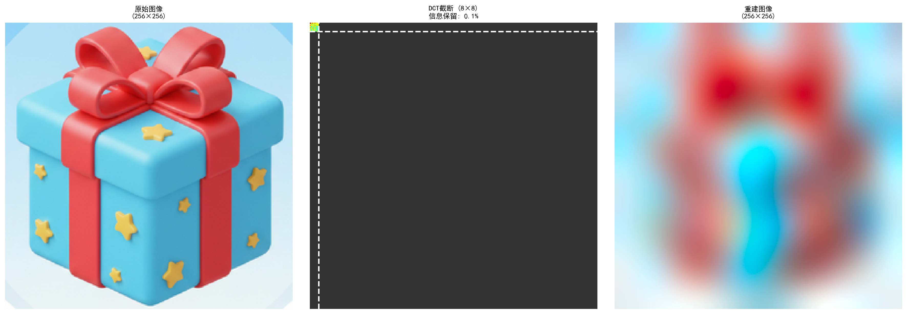

# 查找游戏项目中的相似图片

游戏项目中经常有大量的重复或相似图片，是影响安装包体积的重要因素。
制作过程中由于分包要求、多人同时制作、不清楚已有资源位置、外包美术资源等情况，导致很多类似图片会重复添加，容易发生重复的主要是UI图、特效贴图、通用遮罩图。
为了减少图片冗余和方便分包拆分资源，需要一种能够快速找出相似图片的方法，提供下面2个功能:

1. 输入一张图片，找出项目中与之相似的图片
2. 直接列出项目中所有相似图列表


## 游戏项目的挑战

### 1. 数据规模挑战
以我正在处理的项目为例，**大约57000张图片**需要进行相似性分析，直接的两两比对方法在实际生产中不可行
- **内存压力**: 同时处理所有图片，需要较高峰值内存
- **计算瓶颈**: 直接列出所有相似图，如何优化计算复杂度

### 2. 游戏图片的特征
游戏图片与自然照片的本质区别:
- **透明度信息关键**: UI元素、特效贴图通常包含大量透明区域，Alpha通道携带的形状信息与RGB同等重要，需要自适应权重
- **内容差异显著**: 游戏资产包含UI图标、特效粒子、遮罩纹理等，类型不一致的图片会放在一起对比，且不像照片那样有连续的自然场景，不适合使用提取图片语义的预训练模型


## 方案调研与技术选型

图片匹配已有多种成熟方法，但针对游戏项目的特定需求，需要仔细权衡各方案的优劣:

### 1. 模板匹配
**原理**: 直接对比像素值，使用平方差、相关系数等度量方法
**优势**: 结果精确，实现简单
**劣势**:
- 计算复杂度O(N²·P)，其中P是像素数
- 对尺寸、旋转、光照变化极度敏感
**结论**: 仅适合结果验证阶段，不适合大规模初筛

### 2. SSIM (结构相似性)
**原理**: 从亮度、对比度、结构三个维度衡量图片相似度
**优势**: 符合人眼感知，对压缩失真有较好鲁棒性
**劣势**:
- 计算量比模板匹配更大(需要多尺度窗口滑动)
- 对透明通道处理不友好
- 同样面临O(N²·P)复杂度问题
**结论**: 性能较差，无法解决大规模处理问题

### 3. 感知哈希 (aHash/dHash/pHash/wHash)
**原理**: 降采样至8×8后，生成64位哈希值
> 四个不同的方法计算的分别是:
> aHash (Average Hash / 平均哈希):图像灰度值与平均灰度的大小关系
> dHash (Difference Hash / 差异哈希):相邻像素间的灰度差异梯度
> pHash (Perceptual Hash / 感知哈希):图像的DCT（离散余弦变换）低频系数
> wHash (Wavelet Hash / 小波哈希):图像的DWT（小波变换）低频子带系数

**优势**:
- 极快的比对速度(位运算)
- 对轻微变化有容忍度

**劣势**:
- 信息损失严重: 8×8 = 64个值无法表达游戏资产的细节
- 初筛后哈希数据作废，无法用于精确排序
- 原版算法只支持亮度通道
**结论**: 分层处理思想 - "粗筛+精排"的策略值得采纳，但需要更强大的特征表达

### 4. SIFT/ORB 特征点匹配
**原理**: 检测图像中的角点、边缘等关键点，提取局部描述子进行匹配
**优势**: 对旋转、缩放、部分遮挡有极强鲁棒性
**局限性**:
- 无法处理平滑图片: 游戏UI元素(纯色背景、渐变按钮)提取不到足够特征点，甚至有的图有0个特征点，比如下面的两张图

****
****

**结论**: 对于自然场景有效，但对游戏资产(尤其UI类)效果不佳

### 5. 深度学习特征 (VGG/ResNet)
**原理**: 使用预训练CNN提取高层语义特征
**优势**: 能识别"语义相似"(如不同角度的同一物体)
**劣势**:
- 需要GPU: 有兼容性问题
- 深度特征偏向高层语义，对游戏资产的像素级差异不够敏感，即使使用低层作为特征，如VGG16的Block3并去除池化层，结果也有很强的语义相似性，而非像素相似
**结论**: 对于像素级相似检测，深度学习方法性价比不高

---

## 设计思考与方案选择

通过上述分析，游戏图片相似性检测的理想方案需要满足:
1. **特征表达能力**: 比8×8哈希更强，能保留足够细节
2. **计算效率**: 必须控制计算复杂度
3. **透明通道支持**: 支持RGBA四通道
4. **可索引性**: 特征可用于后续聚类和快速检索，不像哈希那样"用完即扔"

实现路径：
- 五阶段流水线架构
- 每个阶段的核心技术选型与设计权衡如下:

```
阶段1: 特征提取 (Lab+Alpha → DCT 32×32×4)
  原始图像归一化(256×256×4) → DCT变换 → 4096维特征向量

阶段2: 特征降维 (随机森林选择)
  4096维 → 伪标签聚类 → RF特征重要性 → 500维精选特征

阶段3: 聚类索引 (MiniBatchKMeans)
  57000张图 → 4000个簇 → 每簇平均14张 → 复杂度O(N²/k)

阶段4: 空间索引 (BallTree)
  为每个簇构建BallTree → 查询复杂度O(log n)

阶段5: 相似性搜索
  单图查询: 簇内精确搜索 + 可选跨簇扩展
  全量扫描: 簇内图连通分量算法 → 输出相似组
```

> **[图片占位符2: 系统整体架构流程图]**
>
> 展示从图片输入到结果输出的完整流程:
> 预处理 → DCT特征提取 → 降维 → 聚类 → 索引构建 → 两阶段搜索
> 分两个子图: (a)单图查询流程  (b)全量扫描流程

---

### 阶段1: DCT频域特征提取

#### 原理：从空间域到频域的降维

借鉴**JPEG压缩**的成功经验:
- JPEG使用DCT(离散余弦变换)将图像从空间域转换到频域
- **低频分量**包含了图像的主要结构信息
- 舍弃高频细节后仍能保持视觉质量(这正是"相似"的数学表达)

**DCT(离散余弦变换)的核心思想**：
- 将256×256像素图像分解为不同频率的余弦波组合，可以简单理解为二维的FFT
- **低频分量**（左上角区域）包含图像主要结构
- **高频分量**（右下角区域）代表细节纹理和噪声
- DCT系数是**浮点数连续值**(非二值哈希)，可直接用多个下游任务，不像哈希"用完即扔"

DCT数据通过逆变换可以重建出近似原图，下面展示不同DCT尺寸对图像重建质量的影响（每行从左到右：原始图、DCT系数可视化、重建图）：

**256×256 DCT（完整保留，信息保留率100%）：**
<div align="center">
  
</div>

**64×64 DCT（信息保留率6.25%）：**
<div align="center">
  
</div>

**32×32 DCT（信息保留率1.56%）：**
<div align="center">
  
</div>

**8×8 DCT（信息保留率0.10%）：**
<div align="center">
  
</div>

从上面的对比可以看到，32×32 DCT在仅保留1.56%信息的情况下，已能很好地保留图标的主要特征和细节，而8×8则过于模糊失真。

**关键参数选择 - DCT尺寸权衡**：
| DCT尺寸   | 特征维度/通道 | 重建质量     | 适用场景        |
| --------- | ------------- | ------------ | --------------- |
| 8×8       | 64维          | 模糊         | 感知哈希(pHash) |
| 16×16     | 256维         | 可辨识       | 快速原型        |
| **32×32** | **1024维**    | **细节清晰** | **本项目采用**  |
| 64×64     | 4096维        | 接近原图     | 高精度场景      |

#### Lab+Alpha四通道策略

**使用Lab色彩空间+Alpha通道**
- **Lab色彩空间优势**：L(亮度)与ab(色彩)解耦，更符合人眼感知
- **Alpha通道独立性**：游戏UI元素的透明形状信息与颜色同等重要
- **处理流程**：RGB → Lab转换 → 四通道各自DCT → 拼接为4096维向量

#### 工程优化：缓存DCT信息

**挑战**：处理大量图片，每次重启都提取特征耗时较高

**解决方案**：每个图片单独缓存计算结果，采用校验机制确保缓存有效性：
1. **配置一致性校验**：确保DCT参数未变更
2. **修改时间、内容哈希验证**：精确识别文件变化（检测重命名/移动）
- 对于文件夹中的图片文件，先对比时间，然后使用CRC32等轻量级hash算法
- 对于UE引擎，uasset文件默认保存了hash信息（图集中的图片共享一个hash），可以直接使用

日常使用中，只有新增或修改的图片需要重新提取，大幅节省时间
而且通常新增和修改图片占比<10%，后续的模型都只需要增量更新，不需要读取全部特征数据

---

### 阶段2: 智能特征降维

- 原始特征4096维过高，直接用于聚类和索引会导致**维度灾难**

| 问题类型 | 具体影响                                   |
| -------- | ------------------------------------------ |
| 距离失效 | 高维空间中点与点距离趋于相等，聚类算法失效 |
| 计算爆炸 | KMeans迭代复杂度正比于维度                 |
| 过拟合   | 特征数量接近样本数，噪声主导，泛化性能下降 |

使用数据驱动的**随机森林特征选择**方法，降维至500维，兼顾信息保留与计算效率
> 主要还是实际测试结果，随机森林降维后聚类效果和检索准确率明显优于PCA、方差选择、单变量统计

#### 随机森林 vs PCA

| 对比维度     | 随机森林(特征选择)                   | PCA(特征变换)        |
| ------------ | ------------------------------------ | -------------------- |
| **核心理念** | 选择原始DCT系数的子集                | 线性组合生成新正交基 |
| **监督信号** | 有监督(伪标签)，知道哪些特征能区分簇 | 无监督，仅最大化方差 |
| **非线性**   | 决策树可学习特征交互(如Alpha+亮度)   | 仅线性权重组合       |
| **可解释性** | 保留物理意义(如"L通道低频")          | 抽象主成分(PC1/PC2)  |
| **去噪能力** | 直接丢弃不重要特征                   | 噪声特征也参与组合   |

#### 降维目标选择

| 目标维度  | 聚类效果 | 检索速度 | 适用场景     |
| --------- | -------- | -------- | ------------ |
| 200维     | 一般     | 极快     | 快速原型     |
| **500维** | **优秀** | **快**   | **生产推荐** |
| 800维     | 优秀     | 中等     | 精度优先     |
| 1500维    | 边际提升 | 慢       | 不推荐       |

**结论**: 实测表明500维是**性价比最优**选择，在保证聚类质量的同时兼顾计算效率

#### 保存特征选择模型
- 随机森林模型训练完成后，保存变换矩阵或选择器到文件，后续新增图片只需加载模型进行特征选择，无需重新训练

---

### 阶段3: 分治聚类策略

- **KMeans聚类**: 将图片分簇，平均每个簇内15张图，复杂度从O(N²)降至O(N²/k)，k约为簇数量
- **BallTree索引**: 簇内查询复杂度O(log n)，单次查询<1ms
- **增量更新**: 新增<10%图片时自动识别变化，无需全量重算

#### KMeans聚类

根据图片数量选择不同的KMeans变体:

| 对比维度 | MiniBatchKMeans     | 标准KMeans   |
| -------- | ------------------- | ------------ |
| 适用规模 | >10000样本          | <10000样本   |
| 收敛速度 | **3-5倍更快**       | 慢           |
| 内存占用 | 批处理(1000张/批)   | 全量加载     |
| 聚类质量 | 略降(~2%)           | 最优         |
| 增量支持 | partial_fit支持微调 | 需完全重训练 |

#### 簇数量权衡：经验公式与实测验证

**KMeans聚类中选择簇数量的经验法则**：`n_clusters ≈ sqrt(N) 到 N/15`，对于57000张图 → 239至3800

**为什么选择4000簇？**：
1. 相似图会聚集在同一簇，实际分布通常并不均匀，簇内图数量不宜过多，避免影响查询效率，所以选择偏高的簇数量
2. 聚类时间可接受，且有模型缓存机制

> 需要注意的是，MiniBatchKMeans簇数量不能动态，如果图片数量变化较大，需要重新选择簇数量并训练新模型

#### 增量更新：应对项目持续迭代

**场景**：游戏项目每天新增/修改50-500张图，无需重算全部，通常只需要计算新增/修改的原始特征值，然后用缓存的特征选择模型计算降维特征，最后用MiniBatchKMeans的`partial_fit`方法微调模型，`partial_fit`支持增量学习，新增<10%图片无需推倒重来

---

### 阶段4: 构建BallTree空间索引

#### 4.1 为每个簇独立构建BallTree

为了同时满足一次性列出所有相似图片和单图实时查询的需求，需要高效的空间索引结构，**BallTree**天然适合高维数据的近邻搜索，且查询复杂度为O(log n)，非常适合本项目的场景

BallTree构建速度快，可以不缓存，每次启动时动态构建

至此，整个索引结构如下:

```
Level 1: 簇级索引 (4000个簇中心)
    ↓ 预测查询图片所属簇 - O(4000)
Level 2: 簇内索引 (BallTree， 平均14张图)
    ↓ 精确搜索 - O(log 14) ≈ O(4)
Result: Top-K相似图片
```

---

### 阶段5a: 单图查询 - 两阶段搜索策略

> **[图片占位符4: 单图查询流程示意图]**
>
> 可视化展示:
> 1. 输入图片 → 预测所属簇(红色标注)
> 2. 簇内搜索(蓝色区域) → 返回Top-K
> 3. 可选: 跨簇扩展搜索(绿色邻近簇)

**输入**：查询图片路径

**处理流程**：
1. **特征提取与降维**：对查询图片提取DCT特征(4096维) → 随机森林降维(500维)
2. **预测所属簇**：使用KMeans模型预测图片最可能属于的簇ID
3. **簇内精确搜索**：在预测簇内使用BallTree进行k近邻搜索，返回Top-K相似图片
4. **可选跨簇扩展**：若需提升召回率，可搜索相邻的1-3个簇，合并结果并按距离排序

**输出**：相似图片列表（路径 + 相似度分数），按相似度降序排列

**性能**：单次查询毫秒级，满足实时要求

---

### 阶段5b: 全量扫描 - 图连通分量算法

> **[图片占位符5: 全量扫描流程对比图]**
>
> 对比展示两种方法:
> (左)传统方法: 57000张图两两比对，密集连线
> (右)优化方法: 先分4000簇，簇内比对，稀疏连线

**输入**：全部图片的特征向量（已缓存）、相似度阈值

**核心优化思想**：利用聚类结果进行分治处理，避免全局两两比对

**处理流程**：
1. **簇内独立处理**：对每个簇(平均14张图)分别处理，簇间可并行
2. **BallTree半径查询**：在簇内使用BallTree进行半径范围查询，找出相似度超过阈值的图片对
3. **构建相似图**：将查询结果构建为无向图，每个节点代表一张图片，边代表相似关系
4. **连通分量提取**：使用DFS/BFS算法找出图中的所有连通分量，每个连通分量即为一个相似组
5. **计算相似组中心**：对于每个相似组，计算组内图片中心点，继而计算各个图片与中心点的距离，生成相似度矩阵，便于后续排序和展示

**输出**：相似图片组列表，每组包含多张相似图片的路径和相似度矩阵

**为什么选择图连通分量算法？**
- 自动处理传递相似性：如果A与B相似、B与C相似，即使A与C不够相似，三者也会归为一组
- 无需预设组数：自动发现所有相似组，不像聚类需要指定K值

---

## 实测效果验证


### 查重效果

- **检测到4，879个相似组**，包含12，575张相似图片(占比21.82%)
- 典型案例：UI图标系列(仅颜色微调)、特效粒子纹理(旋转/缩放变体)
- 为包体优化和资产管理提供了数据支撑

> **[图片占位符6: 成果展示 - HTML报告截图]**
>
> 展示生成的HTML报告界面，包含统计数据、相似组列表、缩略图网格等

---